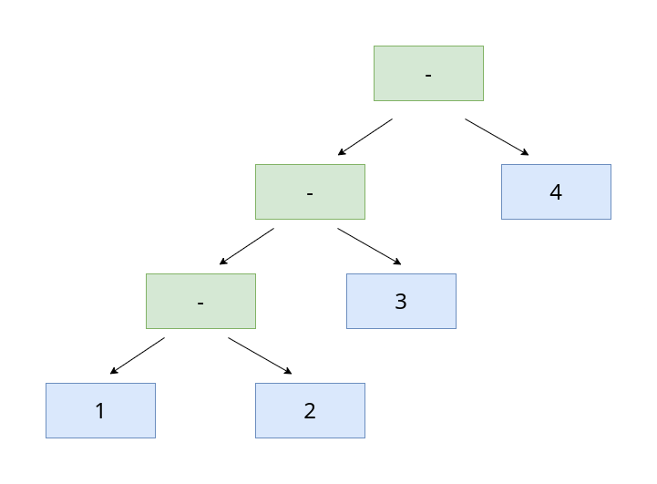
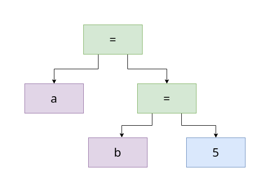
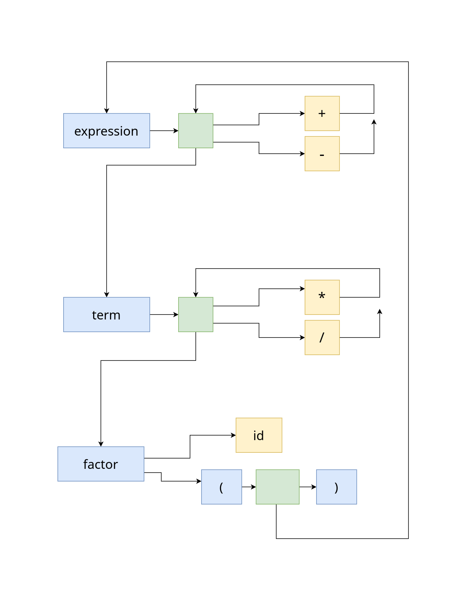

## Вторая стадия: парсер 

### Пререквизиты
  
- Лексер

### Задание

В этом задании от вас требуется научиться разпознавать арифметические выражения
и нектороые утверждения абстрактного языка. Такие выражения встречаются почти в
любом языке программирования.

Но есть и исключения:

- https://lisp-lang.org/learn/functions

  Все выражения явно отделены друг от друга

- https://iolanguage.org/tutorial.html

  Используется метод message-passing

- https://en.wikipedia.org/wiki/Forth_(programming_language)#Overview
  
  Все выражения stack-based (в обратной польской нотации)

Для распознавания (отныне -- парсинг) правил языка нужно составить грамматику.
В описании грамматики есть две важные сущности: precedence (приоритет) и
(associativity) ассоциативность.

Приоритет описывает, какие правила разпознаются сначала (образно говоря, какие
кусочки грамматики сильнее притягиваются друг к другу). Например, `a + b * c`.

Ассоциативность описывает, в какую сторону разпознаются правила с одинаковым
приоритетом. Например, `a - b - c`, `a / b / c`. 



Нарисовать дерево ассоциативности.

В языке Си: `a = b = 5;` -- правосторонняя ассоциативность.



#### Операторы в языке Си

https://en.cppreference.com/w/c/language/operator_precedence

В функциональных языках программированя, таких как Haskell, применение функций
является левоассоциативной операцией [A Gentle Introduction to Haskell,
Functions](https://www.haskell.org/tutorial/functions.html), а коструктор типов
`->` -- правоассоциативной.

### Какая у нас грамматика?

Можно использовать такую грамматику, или несколько модифицировать её.

```
expression     → equality
equality       → comparison ( ( "!=" | "==" ) comparison )* ;
comparison     → term ( ( ">" | ">=" | "<" | "<=" ) term )* ;
term           → factor ( ( "-" | "+" ) factor )* ;
factor         → unary ( ( "/" | "*" ) unary )* ;

unary          → ( "!" | "-" ) unary;
primary        → "true" | "false" | NUMBER |
                 STRING | IDENTIFIER | "(" expression ")";
```

### Рекурсивный спуск

Прочитайте [Crafting-Interpreters: parsing expressions](https://craftinginterpreters.com/parsing-expressions.html)

Каждое правило представляется в виде отдельной функции:

- Каждое правило разпознаёт терминалы и "проваливается" в правила с более
  низким приоритетом. 

  Именно так мы получаем правильные приоритеты.

- Звезда клини (*) представлвяется в виде цикла.

- Ассоциативные правила могут явно подвешивать разпознынные выражения в виде
  правого или левого поддерева.

Следующий пример иллюстрирует все четыре правила.

``` cpp

Expression* ParseComparison() {
  Expression* first = ParseTerm();

  auto token = lexer_.Peek();
  while (Matches(lex::TokenType::LT)) {
    auto second = ParseTerm();
    first = new ComparisonExpression(first, token, second);
  }

  return first;
}

```

#### Изображение



#### Левая рекурсия

Для одного языка можно постстроить несколько грамматик. Например, 
```
factor         → factor ( "/" | "*" ) unary
               | unary ;

factor         → unary ( ( "/" | "*" ) unary )* ;
```

У первого правила есть недостаток: мы не сможем распознать его с помощью
рекурсивного спуска. Первым делом в функции мы запустимся рекурсивно.

Второе правило решает эту проблему с помощью использования цикла. Но теперь мы
должны расставлять ассоциативность в коде самостоятельно. (Первое учитывает её).

#### Постфиксные выражения

Иногда мы можем полностью распознать выражение только после того, как мы
распознали её некоторую часть.

Это явно выражается в присваивании `a = 5`. Сначала мы распознаём `a`,
идентификатор, который может представлять выражение сам по себе. Затем
встречаем `=` и требуется проверить, что то, что было до этого действительно
является LvalueExpression.

```
Statement* Parser::ParseExprStatement() {
  auto expr = ParseExpression();

  if (Matches(lex::TokenType::ASSIGN)) {
    // Check if the expression is assignable
    if (auto target = dynamic_cast<LvalueExpression*>(expr)) {
      return ParseAssignment(target);
    }

    throw parse::errors::ParseNonLvalueError{FormatLocation()};
  }
  ...
}
```

Что такое LvalueExpression:
- https://en.wikipedia.org/wiki/Value_(computer_science)#lrvalue
- https://doc.rust-lang.org/reference/expressions.html#place-expressions-and-value-expressions

  > A place expression is an expression that represents a memory location.
  > These expressions are paths which refer to local variables, static
  > variables, dereferences (*expr), array indexing expressions (expr[expr]),
  > field references (expr.f) and parenthesized place expressions. All other
  > expressions are value expressions.

- https://eli.thegreenplace.net/2011/12/15/understanding-lvalues-and-rvalues-in-c-and-c/


### Представление выражений

Естественным представлением для распознанных правил языка является дерево.

Рассмотрите готовые примеры: 

- ast/expressions.hpp

- ast/statements.hpp

### Visitor pattern

Обратите внимание на метод Accept(), имеющийся в каждом узле AST.

```
class ComparisonExpression : public Expression {
  ...
  virtual void Accept(Visitor* visitor) override {
    visitor->VisitComparison(this);
  }
  ...
}

class BinaryExpression : public Expression {
  ...
  virtual void Accept(Visitor* visitor) override {
    visitor->VisitBinary(this);
  }
  ...
}
```

Это виртаульный метод, который для каждого наследника класса Expression, будет
вызывать нужную функцию. Этот механизм называется Double Dispatching. Мы будем
его использовать для реализации алгоритмов на дереве. Таким образом мы отделяем
алгоритмы от данных. Это похоже на реализацию функций с помощью
pattern-matching-а в функциональный языках.

Прочитайте [Crafting-Interpreters: The expression
problem](https://craftinginterpreters.com/representing-code.html#the-expression-problem).

Иногда такое приближение функционального стиля в императивном языке называют
поведенческим паттерном Посетитель (Visitor), иногда это называют идиомой
языка.

### Что от вас требуется?

1. Дописать функцию Parser::ParseBinary()

   Её потребуется разделить на несколько, чтобы правильно обрабатывались
   приоритеты.

2. Добавить функцию Parser::ParseIfStatement()
3. Добавить функции для парсинга:
   - block statement `{}`
   - return statement

   - определение функции
     
     Пока что забудем о типах аргументов

     `fn f(a, b, c) {...}`

   - вызов функции
     
     `f(1, 2, 4);`

